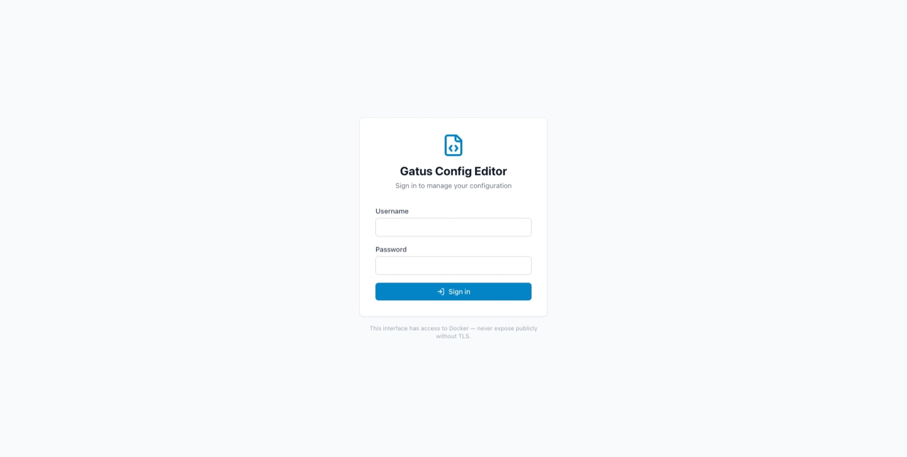
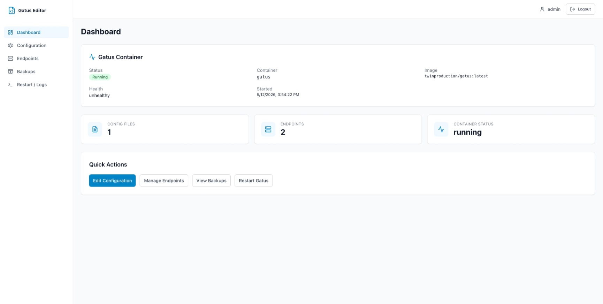
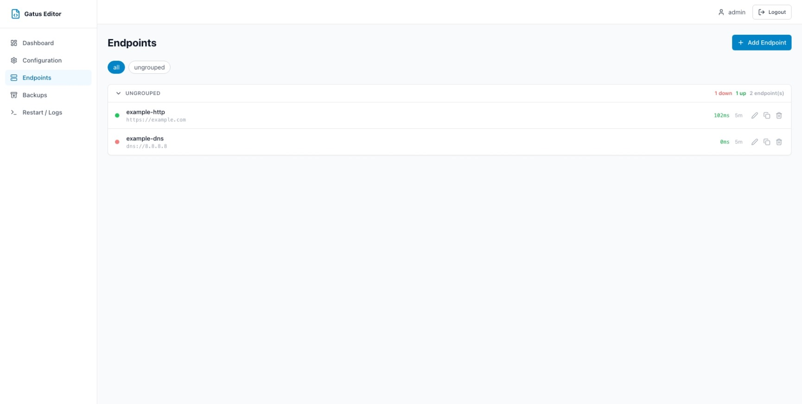
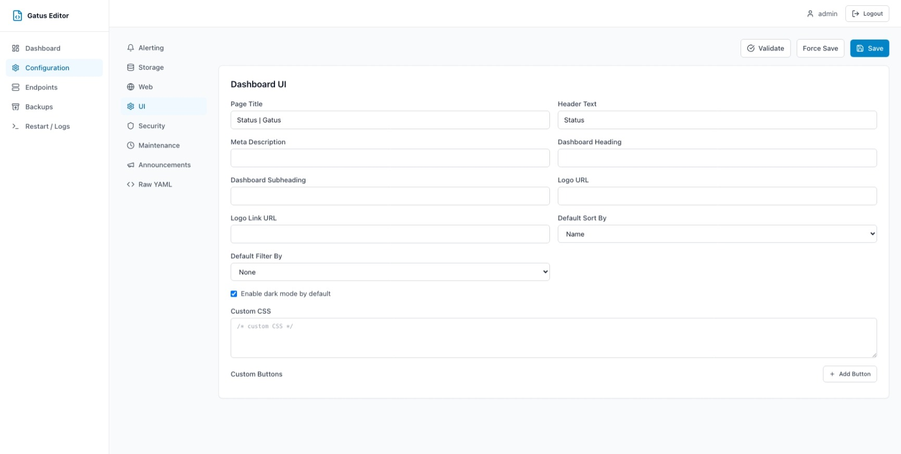
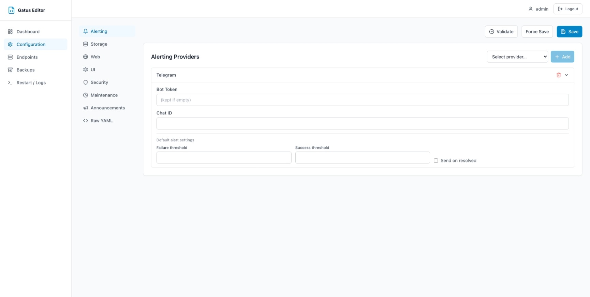
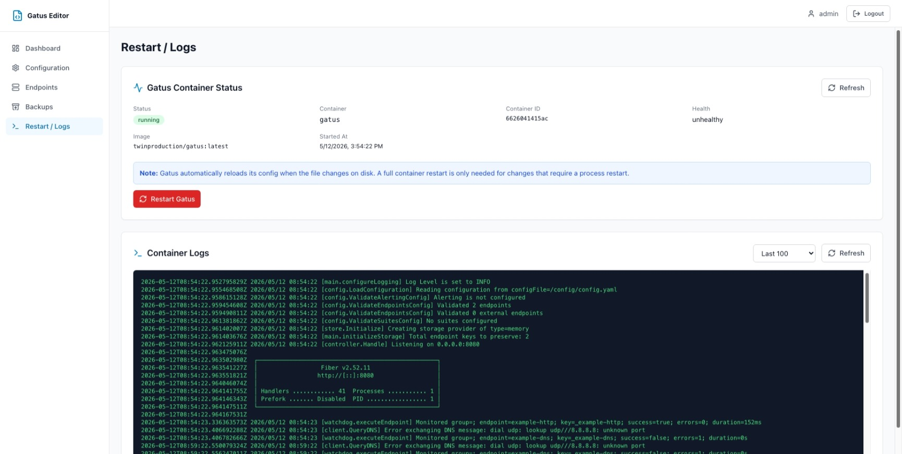

# Gatus Config Editor

> **Note:** This project was designed and fully generated by [Claude](https://claude.ai) (Anthropic AI). The entire codebase — backend, frontend, Docker configuration, and documentation — was produced through an AI-assisted development session.

A browser-based admin UI for managing [Gatus](https://github.com/TwiN/gatus) configuration files.

The primary interface is a **form-based editor** — structured forms, dropdowns, and condition builders replace manual YAML editing. A raw YAML editor is also available as an advanced mode.

---

## Screenshots

<p align="center">
  
  <br/><sub>Login page</sub>
</p>


<sub>Dashboard — container status, config file count, and endpoint count</sub>

<br/><br/>


<sub>Endpoints — live status dots (green/red), response time badges, group summaries</sub>

<br/><br/>

<table>
  <tr>
    <td width="50%" align="center">
      
      <br/><sub>Configuration — UI settings form</sub>
    </td>
    <td width="50%" align="center">
      
      <br/><sub>Configuration — Alerting providers form</sub>
    </td>
  </tr>
</table>

<br/>


<sub>Restart / Logs — container status, restart button, live log viewer</sub>

---

## Architecture

```
┌──────────────────────────────────────────────┐
│  Browser  →  http://localhost:8080           │
└──────────────────┬───────────────────────────┘
                   │ HTTP
┌──────────────────▼───────────────────────────┐
│  gatus-config-editor  (port 8000 → 8080)     │
│  Single container: Go binary + React SPA     │
│  ├── GET /        → serves React SPA         │
│  ├── /api/*       → Go HTTP handlers (chi)   │
│  │   ├── Auth (bcrypt + session cookies)     │
│  │   ├── CSRF protection + rate limiting     │
│  │   ├── Config file CRUD + validation       │
│  │   ├── Backup / rollback / diff            │
│  │   └── Docker Engine API (docker.sock)     │
└──────┬───────────────────────┬───────────────┘
       │ /config volume        │ docker.sock
┌──────▼────────┐   ┌─────────▼───────────────┐
│ Config files  │   │  Gatus container         │
│ /config/*.yaml│   │  (port 8081)             │
│ /config/backups│  └─────────────────────────┘
└───────────────┘
```

**Services in `docker-compose.yml`:**

| Service | Image | Port |
|---------|-------|------|
| `gatus` | `twinproduction/gatus:latest` | 8081 |
| `app`   | Built from root `Dockerfile`  | 8080 (→ internal 8000) |

**Docker image sizes:**

| | Size |
|---|---|
| Final image (`alpine:3.20` + Go binary + React SPA) | ~35 MB |
| RAM at rest | ~15–25 MB |

---

## Quick Start (Local / Development)

### 1. Clone and configure

```bash
git clone https://github.com/dwiprawira/gatus-config-editor
cd gatus-config-editor
cp .env.example .env
```

Edit `.env` — at minimum, change `ADMIN_PASSWORD` and `SESSION_SECRET`.

### 2. Build and start

```bash
docker compose up -d --build
```

> First build takes 2–4 minutes (Go module download + npm install). Subsequent builds use Docker layer cache.

### 3. Open the UI

```
http://localhost:8080
```

Log in with the credentials from your `.env` file.

---

## Deploy to Production (Pre-built Images)

A single pre-built image (Go backend + React frontend combined) is published to GitHub Container Registry on every push to `main`:

| Image | Tag |
|-------|-----|
| `ghcr.io/dwiprawira/gatus-config-editor` | `latest`, `sha-<commit>` |

### 1. Create `.env` on the server

```bash
# Generate a strong session secret (requires openssl)
SESSION_SECRET=$(openssl rand -hex 32)

cat > .env <<EOF
ADMIN_USERNAME=admin
ADMIN_PASSWORD=change-me-strong-password
SESSION_SECRET=${SESSION_SECRET}
GATUS_CONFIG_PATH=/config/config.yaml
GATUS_CONTAINER_NAME=gatus
APP_PORT=8080
ALLOW_DOCKER_RESTART=true
READ_ONLY_MODE=false
HTTPS_ONLY=false
CSRF_ENABLED=true
EOF
```

### 2. Pull and start with pre-built images

```bash
# Download production compose file
curl -O https://raw.githubusercontent.com/dwiprawira/gatus-config-editor/main/docker-compose.prod.yml

# Start
docker compose -f docker-compose.prod.yml up -d
```

### 3. Add your Gatus config

The `gatus-config` named volume is created automatically. Place your config:

```bash
docker exec gatus-config-editor sh -c "cat > /config/config.yaml" <<'EOF'
endpoints:
  - name: my-service
    url: https://example.com
    interval: 5m
    conditions:
      - "[STATUS] == 200"
EOF
```

Or replace the named volume with a bind mount in `docker-compose.prod.yml`:

```yaml
volumes:
  - /path/to/your/config:/config
```

### 4. (Recommended) Run behind a reverse proxy with TLS

Use nginx or Traefik to terminate TLS. Then set `HTTPS_ONLY=true` in `.env`.

Example nginx snippet:

```nginx
server {
    listen 443 ssl;
    server_name gatus-editor.example.com;

    ssl_certificate     /etc/letsencrypt/live/gatus-editor.example.com/fullchain.pem;
    ssl_certificate_key /etc/letsencrypt/live/gatus-editor.example.com/privkey.pem;

    location / {
        proxy_pass http://localhost:8080;
        proxy_set_header Host              $host;
        proxy_set_header X-Real-IP         $remote_addr;
        proxy_set_header X-Forwarded-For   $proxy_add_x_forwarded_for;
        proxy_set_header X-Forwarded-Proto $scheme;
    }
}
```

### Update to latest image

```bash
docker compose -f docker-compose.prod.yml pull
docker compose -f docker-compose.prod.yml up -d
```

---

## Configuration

### Environment Variables

| Variable | Default | Description |
|----------|---------|-------------|
| `APP_PORT` | `8080` | Host port for the web UI |
| `GATUS_CONFIG_PATH` | `/config/config.yaml` | Path to Gatus config file or directory |
| `GATUS_CONTAINER_NAME` | `gatus` | Docker container name for Gatus |
| `GATUS_API_URL` | `http://gatus:8080` | Internal URL to reach Gatus API (for status proxy) |
| `ADMIN_USERNAME` | `admin` | Login username |
| `ADMIN_PASSWORD` | `change-me` | Login password (bcrypt-hashed at startup) |
| `SESSION_SECRET` | `change-me-in-production` | Cookie signing secret — **must be changed** |
| `BACKUP_DIR` | `/config/backups` | Where backups are stored |
| `ALLOW_DOCKER_RESTART` | `true` | Allow UI to restart the Gatus container |
| `READ_ONLY_MODE` | `false` | Disable all config modifications |
| `HTTPS_ONLY` | `false` | Set `true` when behind TLS (secures session cookie) |
| `CSRF_ENABLED` | `true` | Enable CSRF token validation |

---

## Mounting an Existing Gatus Config

The `app` service shares the `/config` volume with the `gatus` service.

### Single-file mode

```yaml
# docker-compose.yml (snippet)
services:
  gatus:
    volumes:
      - /path/to/your/config:/config
  app:
    volumes:
      - /path/to/your/config:/config
    environment:
      GATUS_CONFIG_PATH: /config/config.yaml
```

### Directory mode

If `GATUS_CONFIG_PATH` points to a directory, Gatus loads all `.yaml`/`.yml` files from it:

```yaml
services:
  gatus:
    volumes:
      - /path/to/your/configs:/config
    environment:
      GATUS_CONFIG_PATH: /config
  app:
    volumes:
      - /path/to/your/configs:/config
    environment:
      GATUS_CONFIG_PATH: /config
```

The UI lists all `.yaml`/`.yml` files and allows editing each one individually.

---

## How Restart Works

The backend uses the **Docker Engine API** via the mounted Unix socket (`/var/run/docker.sock`) to restart Gatus. No shell commands are used.

Restart flow:
1. User clicks **Restart Gatus** → confirmation dialog shown.
2. Backend sends `POST /containers/{name}/restart?t=30` to the Docker socket.
3. UI polls container status every 15 seconds and shows result.
4. Recent container logs are displayed.

Gatus also supports hot-reload when its config file changes on disk. The UI notes this and still provides a full restart button for cases that require a process restart.

---

## Backups and Rollback

Before every save, the backend creates a timestamped backup:

```
/config/backups/config-20260512-143000.yaml
/config/backups/config-20260512-143000.yaml.meta.json
```

Each backup has a JSON sidecar with: `original filename`, `timestamp`, `user`, `sha256`.

From the Backups page:
- View backup contents
- Diff backup vs. current config (side-by-side)
- Restore a backup (current file is backed up first)
- Download backup file

---

## Validation

Config validation runs in two layers:

1. **YAML syntax** — checked before any save; exact error reported.
2. **Schema validation** — required fields, URL formats, condition syntax, known alerting providers, valid storage types.

> **Note:** Native Gatus validation (running the actual Gatus binary against the config) is not available because Gatus does not expose a `--validate` CLI flag. Schema-based validation is the primary strategy.

Invalid configs cannot be saved unless the user explicitly chooses **Force Save**.

---

## Security

> **Warning:** Mounting `/var/run/docker.sock` gives the `app` container full Docker access on the host. Never expose this UI to the public internet without authentication and TLS.

Security features:
- Username/password login (bcrypt-hashed at startup)
- Session cookies: `HttpOnly`, `SameSite=Lax`, configurable `Secure` flag
- CSRF token: generated at login, validated on all mutating requests via `X-CSRF-Token` header
- Login rate limiting: 5 failures per 5-minute window per IP → 15-minute lockout
- Security response headers: `X-Content-Type-Options`, `X-Frame-Options`, `X-XSS-Protection`, `Referrer-Policy`
- Secrets (`ADMIN_PASSWORD`, `SESSION_SECRET`) never logged
- Optional `READ_ONLY_MODE` — disables all config writes
- Optional `ALLOW_DOCKER_RESTART=false` — disables container restart

---

## Limitations

- Storage backends supported: `memory`, `sqlite`, `postgres` (mysql not in current Gatus source)
- OIDC authentication for the Gatus status page is form-configurable, but the editor itself only supports username/password login
- `remote` config (aggregating remote Gatus instances) is marked experimental in Gatus
- YAML comments are preserved when saving via the raw YAML editor; form-editor saves reconstruct YAML from the parsed form state and may lose comments
- Native Gatus config validation unavailable (no `--validate` flag in Gatus binary)

---

## Troubleshooting

**UI shows "Cannot connect to backend"**
- Run `docker compose ps` — `app` container must be running
- Check `docker compose logs app` for startup errors

**Cannot restart Gatus**
- Verify `/var/run/docker.sock` is mounted in the `app` container
- Verify `GATUS_CONTAINER_NAME` matches the actual container name (`docker ps`)
- Verify `ALLOW_DOCKER_RESTART=true` in `.env`

**Endpoint statuses not showing**
- Verify `GATUS_API_URL=http://gatus:8080` and the `gatus` container is running
- Check that both `app` and `gatus` services are on the same Docker network

**Config not loading**
- Verify `GATUS_CONFIG_PATH` points to an existing file or directory
- The `app` container runs as root inside Alpine — file permissions should not be an issue with default Docker volumes

**Backup restore fails**
- Check `BACKUP_DIR` is writable inside the container
- Check available disk space

---

## Project Structure

```
gatus-config-editor/
├── Dockerfile                    Multi-stage: Node → Go → Alpine (~35 MB)
├── docker-compose.yml            Local dev: gatus + app
├── docker-compose.prod.yml       Production: uses ghcr.io pre-built image
├── .env.example
├── backend/                      Go backend
│   ├── main.go                   HTTP server (chi router, all handlers)
│   ├── go.mod
│   └── internal/
│       ├── config/               Env-var configuration
│       ├── session/              gorilla/securecookie session management
│       ├── ratelimit/            In-memory per-IP rate limiter
│       ├── discovery/            Config file discovery + path traversal guard
│       ├── yamlutil/             YAML read / write / validate
│       ├── validator/            Gatus schema validation
│       ├── backup/               Backup, rollback, diff
│       └── docker/               Docker Engine API (raw HTTP over Unix socket)
├── frontend/                     React + TypeScript (Vite)
│   ├── src/
│   │   ├── api/                  Axios API client + type definitions
│   │   ├── components/           Layout, UI primitives, config forms, endpoint forms
│   │   ├── pages/                Dashboard, Config, Endpoints, Backups, Operations
│   │   ├── stores/               Zustand auth store
│   │   └── utils/                YAML parse/dump (js-yaml)
│   └── vite.config.ts            Dev proxy: /api → localhost:8000
├── config/
│   ├── config.yaml               Sample Gatus config
│   └── backups/                  Auto-created on first save
└── docs/
    └── *.jpeg                    UI screenshots
```

---

## Upgrade Notes

When upgrading Gatus, the schema may change:
1. Check the [Gatus changelog](https://github.com/TwiN/gatus/releases) for new or removed config keys.
2. Update `backend/internal/validator/validator.go` — `knownTopLevel`, `knownProviders`, `validStorageTypes`.
3. Unknown fields are always preserved in the raw YAML editor (they are never stripped).

---

## About

This project was fully designed and generated by **[Claude](https://claude.ai)** (Anthropic AI, model: claude-sonnet-4-6) through an incremental, checkpoint-based development session. No application code was written manually.

Development workflow: research → scaffold → Go backend → validation → backup/rollback → Docker integration → React frontend → form editor → endpoint forms → YAML editor → operations UI → security hardening → Go rewrite.
